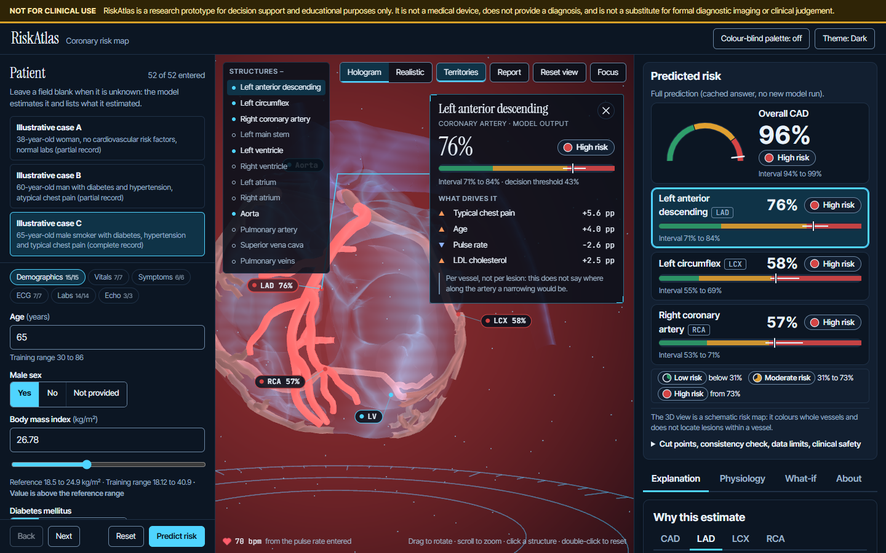
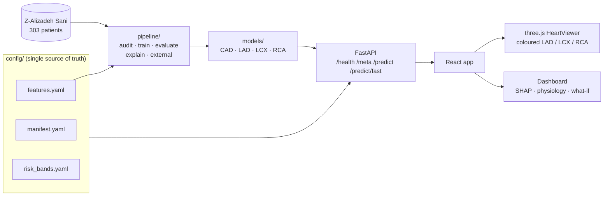

# RiskAtlas

**Interactive 3D cardiovascular risk visualization and prediction.**

[](https://riskatlas-0de1.onrender.com)


**Track A, Multimodal AI Hackathon 2026** (KamandPrompt, IIT Mandi)

RiskAtlas turns a patient's clinical, ECG, laboratory and echocardiographic findings into **calibrated
probabilities** of overall coronary artery disease (CAD) and of stenosis in the **LAD, LCX and RCA**, and draws
them on an interactive 3D heart whose three coronary arteries are coloured by risk band. An explainability
dashboard sits alongside: SHAP breakdown, physiological measurements against their reference ranges,
per-prediction uncertainty and a counterfactual what-if.

The models are small, leakage-guarded and validated by repeated nested cross-validation plus an external check.
Their weak spots (LCX and RCA, ROC-AUC about 0.72 to 0.73) are reported as they are, not hidden.

> **Clinical safety disclaimer.** RiskAtlas is a research prototype for decision support and
> educational purposes only. It is not a medical device, does not provide a diagnosis, and is not a
> substitute for formal diagnostic imaging or clinical judgement.



*The workspace (real API, illustrative high-risk case): click any structure of the heart and its panel opens with
the patient's own values, what drives the estimate and how far to trust it.* The landing page is
[here](docs/figures/app_landing.png). The first version of the UI is kept in
[`web-legacy/`](web-legacy/LEGACY.md) (git tag `legacy-ui-v1`) and is served at `/legacy` by the deployed app.

---

## Table of contents

- [Highlights](#highlights)
- [Live demo](#live-demo)
- [Status](#status)
- [How it works](#how-it-works)
- [Track A requirements and where they are met](#track-a-requirements-and-where-they-are-met)
- [ML results summary](#ml-results-summary)
- [Limitations and intended use](#limitations-and-intended-use)
- [Stack](#stack)
- [Repository layout](#repository-layout)
- [Getting started](#getting-started)
- [Configuration](#configuration)
- [Extending RiskAtlas](#extending-riskatlas)
- [Troubleshooting](#troubleshooting)
- [Documentation index](#documentation-index)
- [Roadmap](#roadmap)
- [Team](#team)
- [Licence](#licence)
- [Data and asset licences](#data-and-asset-licences)
- [Contributing](#contributing)

---

## Highlights

- **Four calibrated models** for overall CAD and for LAD, LCX and RCA stenosis. Vessels are modelled as
  P(CAD) × P(vessel given CAD).
- **A touchable 3D heart.** Every structure can be clicked; the arteries carry the model's output, and the left
  ventricle and aorta carry the findings anchored to them. A heartbeat follows the entered pulse rate, and
  muscle is tinted by the artery that feeds it (approximate). Hologram and realistic looks are available.
- **Explainability built in.** SHAP breakdown (exactly additive in probability space), physiological
  measurements against reference ranges, uncertainty intervals, per-vessel reliability notes and a
  counterfactual what-if that recolours the heart live.
- **Guided report** with a printable one-page summary.
- **Leakage-guarded by design.** `LAD`, `LCX`, `RCA`, `Cath` and `CAD` can never be inputs; the guard is enforced
  at the feature registry, data load, training and inference, with tests, and the API returns HTTP 422 if a
  label key is sent.
- **Honest validation.** Repeated nested cross-validation of the whole procedure, bootstrap intervals,
  calibration, decision curves, and an external check on 920 patients from four UCI sites.
- **Config-driven.** Features, targets, mesh names and band colours live in `config/*.yaml` and are served
  through `/meta`, so the UI adapts without a redesign.
- **Runs without a GPU.** On-demand rendering and an automatic lite path on software GL.
- **Well tested.** Python tests, web unit tests and real-browser tests (accessibility scans and frame-time
  checks included).

## Live demo

**https://riskatlas-0de1.onrender.com**

This is a Render free instance: it sleeps when idle, and the first request can take about a minute while the
models load. One process serves the web app and the API; see [docs/DEPLOY.md](docs/DEPLOY.md) for Docker, Render
and Hugging Face Spaces. The first version of the UI is at `/legacy`.

**Quick tour:** pick one of the three illustrative patients (or type values; every field is optional), press
**Predict risk**, drag a slider to recolour the heart live, then click a vessel to open its panel.

## Status

Working end to end: ML pipeline, FastAPI backend, and a rebuilt web app.

**Built**

- Landing page with a ribcage video that plays as you scroll, and honest validation numbers.
- Workspace with a touchable 3D heart, heartbeat tied to pulse rate, artery-fed muscle tinting (approximate),
  hologram and realistic looks, what-if on the heart, per-vessel reliability notes and an explanation dashboard.
- Guided report with a printable one-page summary.

**Checks**

- 188 Python tests, 234 web unit tests.
- A browser test in real Chrome (`cd web && npm run e2e`): landing, workspace, report, print, axe accessibility
  scans and frame times. About 60 fps with every effect on an integrated GPU.

**Not built**

- The 17-segment bullseye.
- The clinical-report reader (`cv/`) and the natural-language layer (`slm/`); both folders are empty placeholders.

## How it works



1. **Input.** Up to 52 optional features (demographic, examination, ECG, laboratory, echo), defined once in
   `config/features.yaml`.
2. **Predict.** Four calibrated models return P(CAD) and per-vessel probabilities, with intervals.
   Vessel probability is P(CAD) × P(vessel given CAD).
3. **Band.** Each probability is mapped to a risk band using that target's own cut points, then to a colour from
   `config/risk_bands.yaml`. Uncertainty desaturates the vessel colour.
4. **Explain.** SHAP contributions, physiological values against reference ranges, and counterfactual what-ifs
   are shown next to the 3D view. Selecting a vessel in either place selects it in both.

Node names in the `.glb` files are the `mesh` values of `config/manifest.yaml`; a test fails if the manifest,
the type definitions and the `.glb` files disagree.

## Track A requirements and where they are met

| Requirement | How it is met | Details |
|---|---|---|
| Classification models for overall CAD, and LAD, LCX, RCA stenosis | Four calibrated models; vessels are modelled as P(CAD) × P(vessel given CAD) | [ml_methods](docs/ml_methods.md) |
| Inputs: demographic, examination, ECG, laboratory, echo features | 52 inputs from the Extension of Z-Alizadeh Sani dataset, defined once in `config/features.yaml` | [ml_methods](docs/ml_methods.md) |
| Exclude LAD, LCX, RCA, Cath from inputs | Forbidden-name guard at feature registry, data load, training and inference, with tests; the API rejects a label key with HTTP 422 | [leakage_audit](docs/leakage_audit.md) |
| Metrics: accuracy, precision, recall, F1, ROC-AUC | All five, plus Brier, calibration, decision curves, bootstrap intervals; repeated nested CV, external validation | [results below](#ml-results-summary), [ml_results](docs/ml_results.md) |
| Interactive 3D heart (Three.js) | A framework-free three.js class loads a heart mesh with separate `LAD`, `LCX`, `RCA` nodes (a heart, not a full torso) | [viewer](docs/viewer.md) |
| Colour of LAD, LCX, RCA nodes follows predicted probabilities | Probability → band by that target's own cut points → colour from `config/risk_bands.yaml`; uncertainty desaturates the vessel | [viewer](docs/viewer.md) |
| Rotate, zoom, select | Orbit, zoom, pan, click or tap a vessel, keyboard shortcuts; selection is shared with the dashboard. Only the three vessels are selectable, not chambers | [viewer](docs/viewer.md) |
| Dashboard with CAD and vessel probabilities | Probabilities with intervals and band labels beside the 3D view | [web](docs/web.md) |
| Interpretable breakdown (SHAP or LIME) | SHAP in the UI, exactly additive in probability space; LIME is an offline cross-check on ten patients per target | [ml_methods](docs/ml_methods.md) |
| Physiological measurements with their contribution | Physiology tab: value, reference range, status and share of the explanation for the 18 numeric features that have a reference range | [web](docs/web.md) |
| Open-source 3D mesh | Z-Anatomy (from BodyParts3D), CC BY-SA 4.0, built reproducibly into two `.glb` files | [ASSETS_AND_LICENSES](ASSETS_AND_LICENSES.md) |
| Clinical safety disclaimer in the UI | A banner at the top, visible without scrolling and after scrolling, at every tested screen size (7 sizes from 320 to 1920 px wide) | [web](docs/web.md) |
| Responsive without a dedicated GPU | On-demand rendering and an automatic lite path on software GL; measured about 32 to 33 frames per second at 1280×800 on a no-GPU VM, worst case, ±30% | [viewer](docs/viewer.md) section 6 |
| Add features, models or structures without a redesign | Features, targets, mesh names and band colours come from `config/*.yaml` and are served through `/meta` | [web](docs/web.md) |
| Consistent LAD, LCX, RCA correspondence | Node names are the `mesh` values of `config/manifest.yaml`; a test fails if manifest, type and `.glb` files disagree | [viewer](docs/viewer.md) |

## ML results summary

Repeated cross-validation of the whole modelling procedure on all 303 patients (5 folds × 2 repeats; model
selection, tuning, calibration and thresholds are redone inside each fold), with 95% bootstrap intervals.
Generated from `reports/` by `docs/build/gen_tables.py` and checked against
[docs/ml_results.md](docs/ml_results.md) (the last column of the first table is an addition).

<!-- BEGIN:headline-auc -->
| Target | Prevalence | ROC-AUC [95% CI] | Brier [95% CI] | Brier, constant prevalence forecast |
|---|---:|---:|---:|---:|
| CAD | 71.3% | 0.92 [0.88, 0.95] | 0.10 [0.08, 0.12] | 0.20 |
| LAD | 58.4% | 0.84 [0.79, 0.88] | 0.16 [0.14, 0.18] | 0.24 |
| LCX | 39.3% | 0.72 [0.66, 0.77] | 0.20 [0.19, 0.22] | 0.24 |
| RCA | 37.6% | 0.73 [0.67, 0.78] | 0.20 [0.18, 0.21] | 0.23 |
<!-- END:headline-auc -->

<!-- BEGIN:headline-class -->
| Target | Accuracy | Precision | Sensitivity | Specificity | F1 |
|---|---:|---:|---:|---:|---:|
| CAD | 0.83 [0.79, 0.87] | 0.93 [0.90, 0.96] | 0.82 [0.77, 0.86] | 0.86 [0.78, 0.92] | 0.87 [0.84, 0.90] |
| LAD | 0.75 [0.70, 0.79] | 0.78 [0.72, 0.84] | 0.79 [0.74, 0.84] | 0.69 [0.61, 0.77] | 0.78 [0.74, 0.83] |
| LCX | 0.63 [0.58, 0.67] | 0.52 [0.45, 0.59] | 0.78 [0.71, 0.84] | 0.53 [0.46, 0.60] | 0.62 [0.56, 0.68] |
| RCA | 0.64 [0.59, 0.69] | 0.52 [0.44, 0.59] | 0.80 [0.73, 0.87] | 0.55 [0.48, 0.62] | 0.63 [0.56, 0.69] |
<!-- END:headline-class -->

Accuracy, precision, sensitivity, specificity and F1 use the threshold chosen inside each outer fold. The
last column of the first table is the Brier score of always forecasting the prevalence, for reference.

**How to read this**

- **CAD and LAD are strong or good.** LCX and RCA are **moderate**: about half of their positive calls are
  false positives at the chosen threshold, and their Brier scores are only modestly better than a
  prevalence-only forecast. Colours for LCX and RCA should be read as coarse.
- **Protocol history.** A first 61-patient holdout was scored once and then superseded by the cross-validated
  protocol, after its result had been seen. Both are reported in [docs/ml_results.md](docs/ml_results.md).
- **External validation.** A reduced 8-feature CAD model on 920 patients from four UCI sites reaches ROC-AUC
  0.74 [0.71, 0.77] pooled, against 0.89 [0.84, 0.92] internally. The ranking transfers moderately; the
  probabilities and cut points do not without recalibration.
- **Cohort.** Small, single-centre, patients referred for angiography. Predictions are per vessel, not per lesion.

## Limitations and intended use

RiskAtlas is built to show how a calibrated, explainable risk model can be presented spatially. It is **not** a
diagnostic tool.

- **Small, single-centre data.** 303 patients referred for angiography; prevalence is high (71% CAD) and does
  not reflect a general population.
- **Weak vessel models.** LCX and RCA discriminate only moderately (ROC-AUC ≈ 0.72 to 0.73). Treat their colours
  as coarse.
- **Limited transfer.** The CAD ranking transfers moderately to other sites; probabilities and cut points need
  recalibration before use elsewhere.
- **Per vessel, not per lesion.** The model does not localise stenosis within an artery.
- **Approximate anatomy.** Muscle tinting by feeding artery is an approximation, and only the three vessels are
  selectable in the Track A viewer.
- **Not validated clinically.** No prospective evaluation, no regulatory clearance, and no substitute for
  imaging or clinical judgement.

## Stack

| Layer | Tech |
|---|---|
| Frontend | Vite + React + TypeScript; the 3D viewer is a framework-free three.js class (no React Three Fiber), wrapped by one React component |
| Backend | FastAPI (Python) |
| ML | scikit-learn, XGBoost, SHAP, LIME |
| Data | Extension of Z-Alizadeh Sani (303 patients); UCI Heart Disease (920 patients) for external validation |
| 3D | Z-Anatomy heart (CC BY-SA 4.0), `.glb` built by `web/scripts/` |

## Repository layout

```text
config/      single source of truth: features, target->mesh manifest, risk bands, ML settings
pipeline/    training scripts: audit, train, evaluate, explain, external, analysis, counterfactual, report
models/      trained model files (CAD, LAD, LCX, RCA) + metadata.json
reports/     generated metrics and figures (never hand-typed numbers)
api/         FastAPI backend: /health, /meta, /predict, /predict/fast
web/         Vite + React + TypeScript app (dashboard) and the three.js viewer
  src/viewer/          the HeartViewer class (framework-free)
  public/models3d/     heart.glb, heart_lite.glb and their licence files
  scripts/             builds and validates the .glb files from the Z-Anatomy source
  viewer-demo/         stand-alone viewer harness with its own tests and screenshots
web-legacy/  first version of the UI (git tag legacy-ui-v1), served at /legacy
tests/       pytest: leakage, validation procedure, analysis, counterfactuals, API contract
experiments/ model comparison (direct vs hierarchical, TabPFN); not used at runtime
data/        raw and external are gitignored (downloaded); processed/holdout_ids.json is committed
docs/        documentation, figures and the PDF build scripts (docs/build/)
common/, cv/, slm/, notebooks/   empty placeholders (shared helpers live in pipeline/settings.py)
```

## Getting started

### Prerequisites

- **Python 3.11.** The pins in `requirements.txt` are chosen for it (newer xgboost and shap releases need
  Python 3.12). Tested with 3.11.15.
- **Node `^20.19.0` or `>=22.12.0`, and npm 10.** Vite 8 requires this (see `engines` in
  `web/package.json`), so Node 20.0 to 20.18 fails at `npm ci`. Tested with Node 22.22.0 and npm 10.9.4.
  Only the optional `npm run palette` helper needs Node 22.18 or newer.
- A browser with WebGL (software WebGL works, only slower). The browser tests use the Chromium that
  Playwright has already installed (`/opt/pw-browsers` or `PLAYWRIGHT_BROWSERS_PATH`); set `E2E_CHROMIUM`
  to any `chrome` executable otherwise. No browser is downloaded.
- Inference needs neither the dataset nor a GPU: the trained models are committed.

### Run the app (two terminals)

**Terminal 1: backend**

```bash
git clone https://github.com/AmanS-06/riskatlas.git && cd riskatlas
python3.11 -m venv .venv
source .venv/bin/activate          # Windows: .venv\Scripts\activate
pip install -r requirements.txt
uvicorn api.main:app --port 8000   # real models; ready after about 15 s; interactive docs at http://127.0.0.1:8000/docs
```

**Terminal 2: frontend**

```bash
cd web
npm ci                             # exact versions from package-lock.json
npm run dev                        # http://localhost:5173 ; /api is proxied to http://localhost:8000
```

Open the URL that `npm run dev` prints (it is `http://localhost:5173` unless that port is taken). Pick one of
the three illustrative patients or type values (every field is optional), press **Predict risk**, drag a
slider to recolour the heart live, and click a vessel to inspect it.

Check the backend is up with `curl http://127.0.0.1:8000/health`.

### No backend? Use mock mode

| Where | How | Effect |
|---|---|---|
| Web | open `http://localhost:5173/?mock=1`, or `VITE_API_MOCK=1 npm run dev` | Shows a fixed example payload, flagged "MOCK DATA - not a real prediction" on every screen |
| API | `API_MOCK=1 uvicorn api.main:app --port 8000` | No models loaded; every response says `"mock": true` |

### Production build (single process)

```bash
cd web && npm run build            # type-checks and writes web/dist
cd .. && uvicorn api.main:app --port 8000
```

The API process then serves the web app and the API on one port (the API is also at `/api`).
`scripts/serve_prod.sh` / `scripts/serve_prod.ps1` do both steps. `npm run preview` still serves the build on
`http://localhost:4173` with the `/api` proxy. Hosting options: [docs/DEPLOY.md](docs/DEPLOY.md).

### Tests

```bash
python -m pytest                                  # about 1.5 minutes; 169 pass, 3 skip without the dataset
cd web
npm test                                          # 193 unit and component tests (Vitest, jsdom)
npm run e2e                                       # real-browser tests, mock mode
E2E_REAL_API=http://127.0.0.1:8000 npm run e2e    # adds 5 tests against a running backend: 33 in total
npm run typecheck                                 # tsc --noEmit
```

The stand-alone viewer harness has its own tests (72 unit, 56 browser):
`cd web/viewer-demo && npm ci && npm test && npm run test:e2e`.

### Retrain the models (optional)

```bash
python -m pipeline        # audit, train, evaluate, explain, external, analysis, counterfactuals, report
```

This needs the data. The Extension of Z-Alizadeh Sani file is downloaded into `data/raw/`; if the download
fails (a proxy or a blocked host), fetch the xlsx from the
[UCI page](https://archive.ics.uci.edu/dataset/411/extention+of+z+alizadeh+sani+dataset) and place it in
`data/raw/`. The external-validation step downloads the UCI Heart Disease collection (id 45) and caches it as
`data/external/uci_heart_disease_4sites.csv`; if that download fails, save
[heart+disease.zip](https://archive.ics.uci.edu/static/public/45/heart+disease.zip) in the repo root and run:

```bash
python -c "from pathlib import Path; from pipeline.external import parse_zip, CACHE; CACHE.parent.mkdir(parents=True, exist_ok=True); parse_zip(Path('heart+disease.zip').read_bytes()).to_csv(CACHE, index=False)"
```

Single steps run as `python -m pipeline train`, `python -m pipeline report`, and so on. A full run takes
about 15 minutes on a recent laptop (it took about 30 on a shared 4-core VM). The seed is 42: the final models
reproduce exactly, while the cross-validated estimates can move in the third decimal between runs. Results are
written to `reports/` and `docs/ml_results.md`. Methods: [docs/ml_methods.md](docs/ml_methods.md); interface for
the API and frontend: [docs/ml_interface.md](docs/ml_interface.md).

## Configuration

### Environment variables

| Variable | Where | Meaning |
|---|---|---|
| `API_MOCK` | API | `1` serves the fixed example payload and loads no models |
| `API_CORS_ORIGINS` | API | Allowed web origins, comma separated or `*`. Default `http://localhost:5173`. Not needed with the dev or preview proxy |
| `API_CACHE_FAST`, `API_CACHE_FULL` | API | Entries in the two LRU caches (defaults 512 and 64; `0` disables) |
| `API_WARMUP` | API | `0` skips the start-up warm-up prediction (tests do) |
| `SERVE_WEB` | API | `1` serves `web/dist` from the API process, `0` never; default: only if `web/dist/index.html` exists (for `uvicorn api.main:app`) |
| `WEB_DIST` | API | Folder of the built web app (setting it turns serving on) |
| `PORT` | host | Hosts set it; the Docker image uses it |
| `RISKATLAS_ROOT` | API, pipeline | Moves `config/`, `models/` and `reports/` |
| `VITE_API_BASE` | web build | API location, default `/api` |
| `VITE_API_MOCK` | web | `1` starts in mock mode (`?mock=1` does it for one page load) |
| `VITE_API_PROXY` | web dev and preview | Where `/api` is proxied to, default `http://localhost:8000` |
| `E2E_REAL_API`, `E2E_CHROMIUM` | browser tests | Backend URL for the extra suite; path to a chrome binary |

`.env.example` lists every variable with its default, commented out; nothing loads a `.env` file.

### Config files

| File | Controls |
|---|---|
| `config/features.yaml` | The 52 model inputs, their types, reference ranges and the forbidden label names |
| `config/manifest.yaml` | Target → 3D mesh mapping (`LAD`, `LCX`, `RCA` node names) |
| `config/risk_bands.yaml` | Band names, per-target cut points and colours |
| ML settings | Seeds, folds, repeats and model search space, also under `config/` |

### API at a glance

| Endpoint | Purpose |
|---|---|
| `GET /health` | Liveness and model status |
| `GET /meta` | Features, targets, mesh names and band colours; the dashboard builds itself from this |
| `POST /predict` | Full prediction with intervals, SHAP and uncertainty (about 4 s) |
| `POST /predict/fast` | Fast path for live slider updates (about 0.13 s) |

Interactive docs are at `/docs` when the API is running. Full reference, real request and response examples and
error codes: [docs/api.md](docs/api.md).

## Extending RiskAtlas

Because config is the single source of truth, most extensions need no UI redesign.

- **Add or change a feature.** Edit `config/features.yaml`, then retrain with `python -m pipeline train`. The
  API refuses to serve models trained against a different feature file (HTTP 503 `model_mismatch`).
- **Change risk bands or colours.** Edit `config/risk_bands.yaml`; the viewer and dashboard pick it up through
  `/meta`.
- **Add a structure or target.** Add the target and its mesh name to `config/manifest.yaml` and make sure the
  `.glb` contains a node with that name. A test fails if the manifest, types and `.glb` files disagree.
- **Rebuild the 3D assets.** Scripts in `web/scripts/` build and validate the two `.glb` files from the
  Z-Anatomy source.
- **Rebuild the documentation PDF.** See the header of [docs/build/build_pdf.py](docs/build/build_pdf.py).

Hard rules: never hard-code feature names, vessel names, colours or thresholds, and never use `LAD`, `LCX`, `RCA`
or `Cath` as inputs.

## Troubleshooting

- **The 3D view is blank or small.** The status line under the viewer says which path is in use ("Full model",
  "Lite model", "Schematic fallback", or "no WebGL"). Without WebGL the dashboard still works and the vessel
  list shows band and percentage. Enable hardware acceleration in the browser; in a VM, WebGL runs in software
  and the viewer picks its lite path on its own.
- **Port already in use.** Vite moves to the next free port and prints it; use that URL. The `/api` proxy
  needs no CORS setting. If you call the API directly from another origin (`VITE_API_BASE`), add that
  origin to `API_CORS_ORIGINS`; `http://127.0.0.1:5173` and `http://localhost:5173` are different origins.
- **The page shows an error and a Retry button instead of the form.** The dashboard builds itself from `GET /meta`,
  so the API is not up yet (start-up takes about 15 s) or not on port 8000. Use Retry, or "Use mock data
  instead". Check `curl http://127.0.0.1:8000/health`.
- **A corporate proxy or firewall blocks pip, npm or the UCI download.** Configure the proxy for pip and npm;
  for the data, place the files by hand (see [Retrain](#retrain-the-models-optional)).
- **Windows: `DLL load failed while importing _devicearray: An Application Control policy has blocked this file`.**
  A managed-laptop security policy blocked a file from numba (a dependency of shap), so every API and model test
  fails. `requirements.txt` pins numba 0.65.1 and llvmlite 0.47.0, which load fine on such a machine (verified on a
  Windows 11 laptop: 97 passed, 3 skipped). If you installed before that pin, run
  `pip install numba==0.65.1 llvmlite==0.47.0`. If numba is blocked even then, run the Python side on another machine.
- **`npm ci` fails with an engines error.** Node is older than 20.19; upgrade Node.
- **HTTP 503 `model_mismatch`.** The models were trained against a different `config/features.yaml`; run
  `python -m pipeline train`.
- **HTTP 422 `leakage`.** The request contained `LAD`, `LCX`, `RCA`, `Cath` or `CAD`, which are never inputs.
- **First full prediction after a start without warm-up takes about 10 s.** That is why the API warms up at
  start. A full prediction normally takes about 4 s, the fast path about 0.13 s.
- **The live demo is slow to respond.** The Render free instance sleeps when idle; allow about a minute for the
  first request.

## Documentation index

| Topic | Document |
|---|---|
| ML methods | [docs/ml_methods.md](docs/ml_methods.md) |
| ML results (full) | [docs/ml_results.md](docs/ml_results.md) |
| API and frontend interface | [docs/ml_interface.md](docs/ml_interface.md) |
| Leakage audit | [docs/leakage_audit.md](docs/leakage_audit.md) |
| API reference | [docs/api.md](docs/api.md) |
| Web app | [docs/web.md](docs/web.md) |
| 3D viewer | [docs/viewer.md](docs/viewer.md) |
| Deployment (Docker, Render, Hugging Face Spaces) | [docs/DEPLOY.md](docs/DEPLOY.md) |
| Assets and licences | [ASSETS_AND_LICENSES.md](ASSETS_AND_LICENSES.md) |
| Legacy UI | [web-legacy/LEGACY.md](web-legacy/LEGACY.md) |
| Contributions | [docs/CONTRIBUTORS.md](docs/CONTRIBUTORS.md) |

## Roadmap

Not built yet, and the natural next steps:

- [ ] 17-segment bullseye view.
- [ ] Clinical-report reader (`cv/`).
- [ ] Natural-language layer (`slm/`).
- [ ] Recalibration for new sites, so probabilities and cut points transfer.
- [ ] Larger, multi-centre training data to strengthen the LCX and RCA models.

## Team

| Person | Role |
|---|---|
| Aman Saxena | TBD (team to fill in) |
| Harsh Salunkhe | TBD (team to fill in) |
| Anhad Mahajan | TBD (team to fill in) |
| Eshaan [surname] | TBD (team to fill in) |

Each member describes their own contribution in [docs/CONTRIBUTORS.md](docs/CONTRIBUTORS.md).

Parts of the code, tests and documentation were produced with AI assistance and reviewed by
the team. <!-- TODO(team): confirm this wording against the hackathon rules; the rules page was not accessible to the author. -->

## Licence

The RiskAtlas source code and documentation are released under the [MIT licence](LICENSE). Third-party material
keeps its own licence (the 3D heart model is CC BY-SA 4.0, the datasets are CC BY 4.0); see below.

## Data and asset licences

Full list with sources: [ASSETS_AND_LICENSES.md](ASSETS_AND_LICENSES.md). Every dataset and 3D mesh used
must be listed there with its source and licence before it is committed.

**Dataset (training and evaluation).** Alizadehsani, R., Roshanzamir, M., & Sani, Z. (2013).
*extention of Z-Alizadeh sani dataset* [Data set]. UCI Machine Learning Repository.
https://doi.org/10.24432/C5461K. Licensed under CC BY 4.0. (UCI spells "extention" this way; the spelling is
kept on purpose.)

**Dataset (external validation).** Janosi, A., Steinbrunn, W., Pfisterer, M., & Detrano, R. (1989).
*Heart Disease* [Data set]. UCI Machine Learning Repository. https://doi.org/10.24432/C52P4X.
Licensed under CC BY 4.0.

**3D heart model** (`web/public/models3d/heart.glb`, `heart_lite.glb`; licence CC BY-SA 4.0, ShareAlike):

> 3D heart model: derived from "Z-Anatomy – The libre 3D atlas of anatomy" (CC BY-SA 4.0, https://github.com/Z-Anatomy/Models-of-human-anatomy), which is based on "BodyParts3D, (c) The Database Center for Life Science" (CC BY-SA 2.1 Japan). Obtained via the npm package @authorod/svitylo-3d-anatomy-data v1.1.0 (adapted for Svitylo 3D Anatomy Atlas). Changes by this project: extracted the heart, great-vessel and coronary-artery meshes from the combined cardiovascular chunk; split the merged mesh into one named mesh per structure; decoded meshopt/quantised geometry to float; re-centred and rescaled to a unit-size heart; assigned new materials. Distributed under CC BY-SA 4.0 (https://creativecommons.org/licenses/by-sa/4.0/).

The upstream licence chain comes from the packager's own files and is not independently confirmed
([ASSETS_AND_LICENSES.md](ASSETS_AND_LICENSES.md) explains what was and was not verified). The same text is
shown in the app's About tab.

## Contributing

Read the team standard in `docs/` before your first commit. In short:

- Config is the single source of truth: no hardcoded feature names, vessel names,
  colours or thresholds.
- Never use `LAD`, `LCX`, `RCA` or `Cath` as model input features (target leakage).
- `git pull` before you start and before you push. Never force-push `main`.
- Every metric in the docs comes from `reports/`, generated by a script. The tables in this README and in
  `docs/PROJECT_DOCUMENTATION.md` are regenerated and checked by `python docs/build/gen_tables.py --write` and
  `--check`.

Rebuild the project documentation PDF: see the header of [docs/build/build_pdf.py](docs/build/build_pdf.py).

## Citation and acknowledgements

- Training data: Alizadehsani, Roshanzamir & Sani, Extension of Z-Alizadeh Sani dataset, UCI ML Repository.
- External validation data: Janosi, Steinbrunn, Pfisterer & Detrano, Heart Disease, UCI ML Repository.
- 3D anatomy: Z-Anatomy and BodyParts3D (CC BY-SA).
- Built for Track A of the Multimodal AI Hackathon 2026, KamandPrompt, IIT Mandi.
