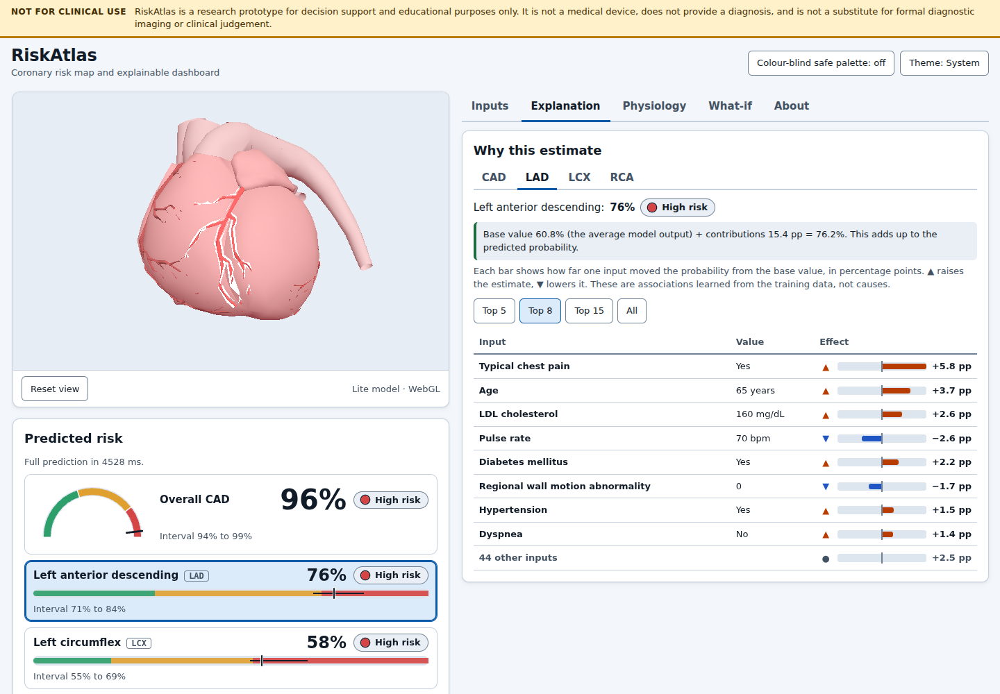

# RiskAtlas

Interactive 3D cardiovascular risk visualization and prediction.

**Track A — Multimodal AI Hackathon 2026** (KamandPrompt, IIT Mandi)

RiskAtlas turns a patient's clinical, ECG, laboratory and echocardiographic findings into calibrated
probabilities of overall coronary artery disease (CAD) and of stenosis in the LAD, LCX and RCA, and
draws them on an interactive 3D heart whose three coronary arteries are coloured by risk band. An
explainability dashboard sits alongside: SHAP breakdown, physiological measurements against their
reference ranges, per-prediction uncertainty and a counterfactual what-if. The models are small,
leakage-guarded and validated by repeated nested cross-validation plus an external check. Their weak
spots (LCX and RCA, ROC-AUC about 0.72 to 0.73) are reported as they are.

> **Clinical safety disclaimer.** RiskAtlas is a research prototype for decision support and
> educational purposes only. It is not a medical device, does not provide a diagnosis, and is not a
> substitute for formal diagnostic imaging or clinical judgement.



*The app against the real API (illustrative high-risk preset, LAD selected), rendered without a GPU,
so the viewer uses its lite model. More views: [3D viewer harness](docs/figures/viewer_selected_LCX.png),
[physiology tab](docs/figures/app_dashboard_moderate_physiology.png),
[what-if tab](docs/figures/app_dashboard_whatif.png).*

---

## Status

Working end to end: ML pipeline, FastAPI backend, React dashboard and three.js viewer are integrated
and tested. Checked on a clean copy: 97 Python tests pass (3 more need the dataset and are skipped), 182
web unit and component tests pass, and 25 browser tests pass, including a suite against the real
backend.

Not built: a heartbeat animation, the 17-segment bullseye, the clinical-report reader (`cv/`) and the
natural-language layer (`slm/`); the last two folders are empty placeholders. Not deployed: there is
no hosted demo, so run it locally (below).

Project documentation (the 6-page document): [docs/PROJECT_DOCUMENTATION.pdf](docs/PROJECT_DOCUMENTATION.pdf)
([Markdown source](docs/PROJECT_DOCUMENTATION.md)).

## Live demo

Not deployed yet.

## Track A requirements and where they are met

| Requirement | How it is met | Details |
|---|---|---|
| Classification models for overall CAD, and LAD, LCX, RCA stenosis | Four calibrated models; vessels are modelled as P(CAD) × P(vessel given CAD) | [ml_methods](docs/ml_methods.md) |
| Inputs: demographic, examination, ECG, laboratory, echo features | 52 inputs from the Extension of Z-Alizadeh Sani dataset, defined once in `config/features.yaml` | [ml_methods](docs/ml_methods.md) |
| Exclude LAD, LCX, RCA, Cath from inputs | Forbidden-name guard at feature registry, data load, training and inference, with tests; the API rejects a label key with HTTP 422 | [leakage_audit](docs/leakage_audit.md) |
| Metrics: accuracy, precision, recall, F1, ROC-AUC | All five, plus Brier, calibration, decision curves, bootstrap intervals; repeated nested CV, external validation | [results below](#ml-results-summary), [ml_results](docs/ml_results.md) |
| Interactive 3D heart (Three.js) | A framework-free three.js class loads a heart mesh with separate `LAD`, `LCX`, `RCA` nodes (a heart, not a full torso) | [viewer](docs/viewer.md) |
| Colour of LAD, LCX, RCA nodes follows predicted probabilities | Probability → band by that target's own cut points → colour from `config/risk_bands.yaml`; uncertainty desaturates the vessel | [viewer](docs/viewer.md) |
| Rotate, zoom, select | Orbit, zoom, pan, click or tap a vessel, keyboard shortcuts; selection is shared with the dashboard. Only the three vessels are selectable, not chambers | [viewer](docs/viewer.md) |
| Dashboard with CAD and vessel probabilities | Probabilities with intervals and band labels beside the 3D view | [web](docs/web.md) |
| Interpretable breakdown (SHAP or LIME) | SHAP in the UI, exactly additive in probability space; LIME is an offline cross-check on ten patients per target | [ml_methods](docs/ml_methods.md) |
| Physiological measurements with their contribution | Physiology tab: value, reference range, status and share of the explanation for the 18 numeric features that have a reference range | [web](docs/web.md) |
| Open-source 3D mesh | Z-Anatomy (from BodyParts3D), CC BY-SA 4.0, built reproducibly into two `.glb` files | [ASSETS_AND_LICENSES](ASSETS_AND_LICENSES.md) |
| Clinical safety disclaimer in the UI | A banner at the top, visible without scrolling and after scrolling, at every tested screen size | [web](docs/web.md) |
| Responsive without a dedicated GPU | On-demand rendering and an automatic lite path on software GL; measured 27 to 32 frames per second on a no-GPU VM, worst case, ±30% | [viewer](docs/viewer.md) section 6 |
| Add features, models or structures without a redesign | Features, targets, mesh names and band colours come from `config/*.yaml` and are served through `/meta` | [web](docs/web.md) |
| Consistent LAD, LCX, RCA correspondence | Node names are the `mesh` values of `config/manifest.yaml`; a test fails if manifest, type and `.glb` files disagree | [viewer](docs/viewer.md) |

## Stack

| Layer | Tech |
|---|---|
| Frontend | Vite + React + TypeScript; the 3D viewer is a framework-free three.js class (no React Three Fiber), wrapped by one React component |
| Backend | FastAPI (Python) |
| ML | scikit-learn, XGBoost, SHAP, LIME |
| Data | Extension of Z-Alizadeh Sani (303 patients); UCI Heart Disease (920 patients) for external validation |
| 3D | Z-Anatomy heart (CC BY-SA 4.0), `.glb` built by `web/scripts/` |

## ML results summary

Repeated cross-validation of the whole modelling procedure on all 303 patients (5 folds × 2 repeats; model
selection, tuning, calibration and thresholds are redone inside each fold), with 95% bootstrap intervals.
Generated from `reports/` by `docs/build/gen_tables.py` and checked against
[docs/ml_results.md](docs/ml_results.md) (the last column of the first table is an addition).

<!-- BEGIN:headline-auc -->
| Target | Prevalence | ROC-AUC [95% CI] | Brier [95% CI] | Brier, constant prevalence forecast |
|---|---:|---:|---:|---:|
| CAD | 71.3% | 0.92 [0.88, 0.95] | 0.10 [0.08, 0.12] | 0.20 |
| LAD | 58.4% | 0.84 [0.79, 0.88] | 0.16 [0.14, 0.18] | 0.24 |
| LCX | 39.3% | 0.72 [0.66, 0.77] | 0.20 [0.19, 0.22] | 0.24 |
| RCA | 37.6% | 0.73 [0.67, 0.78] | 0.20 [0.18, 0.21] | 0.23 |
<!-- END:headline-auc -->

<!-- BEGIN:headline-class -->
| Target | Accuracy | Precision | Sensitivity | Specificity | F1 |
|---|---:|---:|---:|---:|---:|
| CAD | 0.83 [0.79, 0.87] | 0.93 [0.90, 0.96] | 0.82 [0.77, 0.86] | 0.86 [0.78, 0.92] | 0.87 [0.84, 0.90] |
| LAD | 0.75 [0.70, 0.79] | 0.78 [0.72, 0.84] | 0.79 [0.74, 0.84] | 0.69 [0.61, 0.77] | 0.78 [0.74, 0.83] |
| LCX | 0.63 [0.58, 0.67] | 0.52 [0.45, 0.59] | 0.78 [0.71, 0.84] | 0.53 [0.46, 0.60] | 0.62 [0.56, 0.68] |
| RCA | 0.64 [0.59, 0.69] | 0.52 [0.44, 0.59] | 0.80 [0.73, 0.87] | 0.55 [0.48, 0.62] | 0.63 [0.56, 0.69] |
<!-- END:headline-class -->

Accuracy, precision, sensitivity, specificity and F1 use the threshold chosen inside each outer fold. The
last column of the first table is the Brier score of always forecasting the prevalence, for reference.

- CAD and LAD are strong or good. **LCX and RCA are moderate**: about half of their positive calls are
  false positives at the chosen threshold, and their Brier scores are only modestly better than a
  prevalence-only forecast. Colours for LCX and RCA should be read as coarse.
- A first 61-patient holdout was scored once and then superseded by the cross-validated protocol, after its
  result had been seen. Both are reported in [docs/ml_results.md](docs/ml_results.md).
- External validation of a reduced 8-feature CAD model on 920 patients from four UCI sites: ROC-AUC
  0.74 [0.71, 0.77] pooled, against 0.89 [0.84, 0.92] internally. The ranking transfers moderately; the
  probabilities and cut points do not without recalibration.
- Small, single-centre cohort of patients referred for angiography. Predictions are per vessel, not per
  lesion.

## Repository layout

```text
config/      single source of truth: features, target->mesh manifest, risk bands, ML settings
pipeline/    training scripts: audit, train, evaluate, explain, external, analysis, counterfactual, report
models/      trained model files (CAD, LAD, LCX, RCA) + metadata.json
reports/     generated metrics and figures (never hand-typed numbers)
api/         FastAPI backend: /health, /meta, /predict, /predict/fast
web/         Vite + React + TypeScript app (dashboard) and the three.js viewer
  src/viewer/          the HeartViewer class (framework-free)
  public/models3d/     heart.glb, heart_lite.glb and their licence files
  scripts/             builds and validates the .glb files from the Z-Anatomy source
  viewer-demo/         stand-alone viewer harness with its own tests and screenshots
tests/       pytest: leakage, validation procedure, analysis, counterfactuals, API contract
experiments/ model comparison (direct vs hierarchical, TabPFN); not used at runtime
data/        raw and external are gitignored (downloaded); processed/holdout_ids.json is committed
docs/        documentation, figures and the PDF build scripts (docs/build/)
common/, cv/, slm/, notebooks/   empty placeholders (shared helpers live in pipeline/settings.py)
```

## Getting started

### Prerequisites

- **Python 3.11.** The pins in `requirements.txt` are chosen for it (newer xgboost and shap releases need
  Python 3.12). Tested with 3.11.15.
- **Node `^20.19.0` or `>=22.12.0`, and npm 10.** Vite 8 requires this (see `engines` in
  `web/package.json`), so Node 20.0 to 20.18 fails at `npm ci`. Tested with Node 22.22.0 and npm 10.9.4.
  Only the optional `npm run palette` helper needs Node 22.18 or newer.
- A browser with WebGL (software WebGL works, only slower). The browser tests use the Chromium that
  Playwright has already installed (`/opt/pw-browsers` or `PLAYWRIGHT_BROWSERS_PATH`); set `E2E_CHROMIUM`
  to any `chrome` executable otherwise. No browser is downloaded.
- Inference needs neither the dataset nor a GPU: the trained models are committed.

### Run the app (two terminals)

```bash
git clone https://github.com/AmanS-06/riskatlas.git && cd riskatlas
python3.11 -m venv .venv
source .venv/bin/activate          # Windows: .venv\Scripts\activate
pip install -r requirements.txt
uvicorn api.main:app --port 8000   # real models; ready after about 15 s; interactive docs at http://127.0.0.1:8000/docs
```

```bash
cd web
npm ci                             # exact versions from package-lock.json
npm run dev                        # http://localhost:5173 ; /api is proxied to http://localhost:8000
```

Open the URL that `npm run dev` prints (it is `http://localhost:5173` unless that port is taken). Pick one of
the three illustrative patients or type values (every field is optional), press **Predict risk**, drag a
slider to recolour the heart live, and click a vessel to inspect it.

**No backend?** Open `http://localhost:5173/?mock=1`, or start the app with `VITE_API_MOCK=1 npm run dev`: it
then shows a fixed example payload, flagged "MOCK DATA - not a real prediction" on every screen. The API has
its own mock mode, `API_MOCK=1 uvicorn api.main:app --port 8000` (no models loaded; every response says
`"mock": true`).

**Production build.** `cd web && npm run build` type-checks and writes `web/dist`; `npm run preview` serves
it on `http://localhost:4173` with the same `/api` proxy. A real deployment must either rewrite `/api/*` to
the backend (stripping `/api`) or build with `VITE_API_BASE=https://your-api` and set `API_CORS_ORIGINS` on
the API to the web origin.

### Tests

```bash
python -m pytest                                  # about a minute; 97 pass, 3 skip without the dataset
cd web
npm test                                          # 182 unit and component tests (Vitest, jsdom)
npm run e2e                                       # 25 real-browser tests, mock mode
E2E_REAL_API=http://127.0.0.1:8000 npm run e2e    # adds the suite against a running backend
npm run typecheck                                 # tsc --noEmit
```

The stand-alone viewer harness has its own tests: `cd web/viewer-demo && npm ci && npm test && npm run test:e2e`.

### Retrain the models (optional)

```bash
python -m pipeline        # audit, train, evaluate, explain, external, analysis, counterfactuals, report
```

This needs the data. The Extension of Z-Alizadeh Sani file is downloaded into `data/raw/`; if the download
fails (a proxy or a blocked host), fetch the xlsx from the
[UCI page](https://archive.ics.uci.edu/dataset/411/extention+of+z+alizadeh+sani+dataset) and place it in
`data/raw/`. The external-validation step downloads the UCI Heart Disease collection (id 45) and caches it as
`data/external/uci_heart_disease_4sites.csv`; if that download fails, save
[heart+disease.zip](https://archive.ics.uci.edu/static/public/45/heart+disease.zip) in the repo root and run:

```bash
python -c "from pathlib import Path; from pipeline.external import parse_zip, CACHE; CACHE.parent.mkdir(parents=True, exist_ok=True); parse_zip(Path('heart+disease.zip').read_bytes()).to_csv(CACHE, index=False)"
```

Single steps run as `python -m pipeline train`, `python -m pipeline report`, and so on. A full run takes
about 15 minutes on a recent laptop (it took about 30 on a shared 4-core VM). The seed is 42: the final models
reproduce exactly, while the cross-validated estimates can move in the third decimal between runs. Results are written to `reports/` and `docs/ml_results.md`. Methods:
[docs/ml_methods.md](docs/ml_methods.md); interface for the API and frontend:
[docs/ml_interface.md](docs/ml_interface.md).

### Environment variables

| Variable | Where | Meaning |
|---|---|---|
| `API_MOCK` | API | `1` serves the fixed example payload and loads no models |
| `API_CORS_ORIGINS` | API | Allowed web origins, comma separated or `*`. Default `http://localhost:5173`. Not needed with the dev or preview proxy |
| `API_CACHE_FAST`, `API_CACHE_FULL` | API | Entries in the two LRU caches (defaults 512 and 64; `0` disables) |
| `API_WARMUP` | API | `0` skips the start-up warm-up prediction (tests do) |
| `RISKATLAS_ROOT` | API, pipeline | Moves `config/`, `models/` and `reports/` |
| `VITE_API_BASE` | web build | API location, default `/api` |
| `VITE_API_MOCK` | web | `1` starts in mock mode (`?mock=1` does it for one page load) |
| `VITE_API_PROXY` | web dev and preview | Where `/api` is proxied to, default `http://localhost:8000` |
| `E2E_REAL_API`, `E2E_CHROMIUM` | browser tests | Backend URL for the extra suite; path to a chrome binary |

`.env.example` lists some of these under older names; the table above is what the code reads. Full API
reference, real request and response examples, error codes: [docs/api.md](docs/api.md). Web app:
[docs/web.md](docs/web.md). 3D viewer: [docs/viewer.md](docs/viewer.md).

### Troubleshooting

- **The 3D view is blank or small.** The status line under the viewer says which path is in use ("Full model",
  "Lite model", "Schematic fallback", or "no WebGL"). Without WebGL the dashboard still works and the vessel
  list shows band and percentage. Enable hardware acceleration in the browser; in a VM, WebGL runs in software
  and the viewer picks its lite path on its own.
- **Port already in use.** Vite moves to the next free port and prints it; use that URL. The `/api` proxy
  needs no CORS setting. If you call the API directly from another origin (`VITE_API_BASE`), add that
  origin to `API_CORS_ORIGINS`; `http://127.0.0.1:5173` and `http://localhost:5173` are different origins.
- **The page shows an error and a Retry button instead of the form.** The dashboard builds itself from `GET /meta`,
  so the API is not up yet (start-up takes about 15 s) or not on port 8000. Use Retry, or "Use mock data
  instead". Check `curl http://127.0.0.1:8000/health`.
- **A corporate proxy or firewall blocks pip, npm or the UCI download.** Configure the proxy for pip and npm;
  for the data, place the files by hand (see Retrain).
- **`npm ci` fails with an engines error.** Node is older than 20.19; upgrade Node.
- **HTTP 503 `model_mismatch`.** The models were trained against a different `config/features.yaml`; run
  `python -m pipeline train`.
- **HTTP 422 `leakage`.** The request contained `LAD`, `LCX`, `RCA`, `Cath` or `CAD`, which are never inputs.
- **First full prediction after a start without warm-up takes about 10 s.** That is why the API warms up at
  start. A full prediction normally takes about 4 s, the fast path about 0.13 s.

## Team

| Person | Role |
|---|---|
| Aman Saxena | TBD (team to fill in) |
| Harsh Salunkhe | TBD (team to fill in) |
| Anhad Mahajan | TBD (team to fill in) |
| Eshaan [surname] | TBD (team to fill in) |

Each member describes their own contribution in [docs/CONTRIBUTORS.md](docs/CONTRIBUTORS.md).

Parts of the code, tests and documentation were produced with AI assistance (Claude Code) and reviewed by
the team. <!-- TODO(team): confirm this wording against the hackathon rules; the rules page was not accessible to the author. -->

## Data and asset licences

Full list with sources: [ASSETS_AND_LICENSES.md](ASSETS_AND_LICENSES.md). Every dataset and 3D mesh used
must be listed there with its source and licence before it is committed.

**Dataset (training and evaluation).** Alizadehsani, R., Roshanzamir, M., & Sani, Z. (2013).
*extention of Z-Alizadeh sani dataset* [Data set]. UCI Machine Learning Repository.
https://doi.org/10.24432/C5461K. Licensed under CC BY 4.0. (UCI spells "extention" this way; the spelling is
kept on purpose.)

**Dataset (external validation).** Janosi, A., Steinbrunn, W., Pfisterer, M., & Detrano, R. (1989).
*Heart Disease* [Data set]. UCI Machine Learning Repository. https://doi.org/10.24432/C52P4X.
Licensed under CC BY 4.0.

**3D heart model** (`web/public/models3d/heart.glb`, `heart_lite.glb`; licence CC BY-SA 4.0, ShareAlike):

> 3D heart model: derived from "Z-Anatomy – The libre 3D atlas of anatomy" (CC BY-SA 4.0, https://github.com/Z-Anatomy/Models-of-human-anatomy), which is based on "BodyParts3D, (c) The Database Center for Life Science" (CC BY-SA 2.1 Japan). Obtained via the npm package @authorod/svitylo-3d-anatomy-data v1.1.0 (adapted for Svitylo 3D Anatomy Atlas). Changes by this project: extracted the heart, great-vessel and coronary-artery meshes from the combined cardiovascular chunk; split the merged mesh into one named mesh per structure; decoded meshopt/quantised geometry to float; re-centred and rescaled to a unit-size heart; assigned new materials. Distributed under CC BY-SA 4.0 (https://creativecommons.org/licenses/by-sa/4.0/).

The upstream licence chain comes from the packager's own files and is not independently confirmed
([ASSETS_AND_LICENSES.md](ASSETS_AND_LICENSES.md) explains what was and was not verified). The same text is
shown in the app's About tab. The licence of the application source code is not yet stated in this
repository.

## Contributing

Read the team standard in `docs/` before your first commit. In short:

- Config is the single source of truth — no hardcoded feature names, vessel names,
  colours or thresholds.
- Never use `LAD`, `LCX`, `RCA` or `Cath` as model input features (target leakage).
- `git pull` before you start and before you push. Never force-push `main`.
- Every metric in the docs comes from `reports/`, generated by a script. The tables in this README and in
  `docs/PROJECT_DOCUMENTATION.md` are regenerated and checked by `python docs/build/gen_tables.py --write` and `--check`.

Rebuild the project documentation PDF: see the header of [docs/build/build_pdf.py](docs/build/build_pdf.py).
