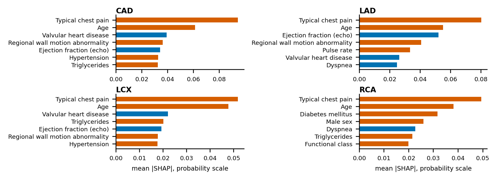

# RiskAtlas: Project Documentation

Multimodal AI Hackathon 2026, Track A: Cardiovascular Risk Visualization and Prediction. Team: Aman Saxena, Harsh Salunkhe, Anhad Mahajan, Eshaan [surname: team to fill in]. Describes the models trained on 2026-10-04 on 303 patients (<code>models/metadata.json</code>). Every number below comes from <code>reports/</code>, <code>models/</code>, <code>config/</code>, the repo docs it names, or a check named where it appears.

> **Clinical safety disclaimer.** RiskAtlas is a research prototype for decision support and educational purposes only. It is not a medical device, does not provide a diagnosis, and is not a substitute for formal diagnostic imaging or clinical judgement.

## 1. Overview and problem

Track A asks for a system that predicts coronary artery disease (CAD) and stenosis of the LAD, LCX and RCA from clinical, ECG, laboratory and echocardiographic features, maps the predictions onto an interactive 3D anatomical model, and explains them. RiskAtlas has four parts: (1) leakage-guarded, calibrated models for CAD, LAD, LCX and RCA, validated by repeated nested cross-validation plus an external check; (2) a FastAPI service; (3) a React dashboard with probabilities and uncertainty, a SHAP breakdown, physiological measurements against reference ranges and a counterfactual what-if; (4) a three.js heart whose LAD, LCX and RCA meshes are coloured from the predicted probabilities. Predictions are per vessel. They do not locate a lesion inside a vessel, and the Track A primer says regional wall motion is not a lesion map.

**Evidence map** (criterion to where the evidence is; details in the sections named):

| Criterion (weight) | Evidence |
|---|---|
| Predictive performance (30%) | Sec. 4: nested CV with bootstrap intervals, calibration, decision curves, the superseded 61-patient holdout, external validation on 920 patients; <code>docs/ml_results.md</code>, <code>reports/</code> |
| 3D visualization (25%) | Sec. 6: real coronary meshes named LAD, LCX, RCA, colour from per-target bands, uncertainty, selection, measured frame rates without a GPU; <code>docs/viewer.md</code> |
| Clinical interpretability (20%) | Sec. 5: exactly additive SHAP, LIME cross-check, physiology panel, counterfactuals; <code>docs/web.md</code> |
| System integration (15%) | Sec. 7: config to pipeline to models to API to dashboard and viewer, fast and full endpoints, 97 + 182 + 25 passing tests; <code>docs/api.md</code> |
| Technical implementation (10%) | Sec. 2, 3, 10: public datasets and meshes with licences, leakage tests, one-command retrain, pinned dependencies; <code>ASSETS_AND_LICENSES.md</code> |

## 2. Data and preprocessing

**Source.** Extension of Z-Alizadeh Sani, UCI id 411, CC BY 4.0: 303 patients, 59 columns (55 candidate inputs plus the four outcome columns LAD, LCX, RCA and Cath), no missing cells, no duplicate rows (<code>reports/data_audit.json</code>, SHA-256 prefix <code>739343245c2b</code>). **52 inputs are used**: weight and height are dropped because BMI carries them, and exertional chest pain is constant. They fall into demographics and risk factors (15), laboratory (14), vital signs and examination (7), ECG (7), symptoms (6) and echocardiography (3); 21 are numeric, 29 binary, 2 categorical (<code>config/features.yaml</code>).

**Labels.** CAD means at least 50% narrowing in any major vessel (the <code>Cath</code> column); LAD, LCX and RCA are each "Stenotic" or not. Prevalence is 71.3%, 58.4%, 39.3% and 37.6%. The labels agree with the CAD definition except for one patient (row 93, counting from 0) who has a stenotic vessel but no CAD label. The record is kept as it is, because editing labels to fit a definition is itself leakage from the analyst (<code>docs/leakage_audit.md</code>).

**Leakage exclusions.** <code>LAD</code>, <code>LCX</code>, <code>RCA</code>, <code>Cath</code> and <code>CAD</code> are never inputs, and no vessel label predicts another vessel. The list is read from <code>config/manifest.yaml</code> and enforced at four points (feature registry, dataset load, training, inference) with tests; the API rejects a request containing a label with HTTP 422. Preprocessing (median imputation and scaling for numeric, most-frequent imputation for binary, one-hot for the two categorical features) sits inside a scikit-learn <code>Pipeline</code>, so it is refit on every training fold. Blank fields are allowed at inference: they are imputed and listed to the user as "estimated without".

**Row order.** The spreadsheet is partly ordered by outcome: the ROC-AUC of row position against CAD is 0.355 (Spearman p = 7e-5), against LAD 0.407, against LCX 0.394 and against RCA 0.450 (not significant) (<code>docs/build/row_order_check.json</code>, our own check, not part of the ML reports). So no split is taken by position: every outer fold is stratified and shuffled (<code>RepeatedStratifiedKFold</code>, inner <code>StratifiedKFold(shuffle=True)</code>), and the row index is never a feature.

**Selection bias.** All patients were referred for angiography, so prevalence is far above a screening population and symptoms such as typical chest pain partly reflect why a patient was referred. The models estimate risk among patients like these, not in the general public. The audit also flags five very rare binary features (kept, the regularised models cope) and BMI, blood pressure and ejection fraction as mostly outside adult reference ranges, which fits a cardiac referral cohort rather than a unit error.

## 3. Model architecture

**Conditional vessel models.** CAD is a direct binary model. Each vessel is modelled through it: P(vessel) = P(CAD) × P(vessel | CAD), with the conditional part trained on CAD-positive patients only. Because CAD means "at least one stenotic vessel", this guarantees a vessel never looks riskier than CAD, and the vessel models borrow strength from the strongest model. Independent models would have put P(CAD) below the riskiest vessel for about a fifth of patients (<code>docs/ml_methods.md</code>). On held-out predictions 0.0% of patients fall below their top vessel (largest gap -0.009). The structure is declared in the manifest (<code>conditional_on</code>), not hardcoded.

**Family selection.** Four candidates per model part: L2 logistic regression, random forest, XGBoost (shallow, regularised) and a soft-voting ensemble, each wrapped in Platt calibration (3-fold). Per target, repeated stratified CV (5 folds × 3 repeats) with hyperparameters tuned in an inner 3-fold loop, then the one-standard-error rule (Nadeau-Bengio corrected): the simplest family within one SE of the best. Mean ROC-AUC (SE) per family:

<!-- BEGIN:selection -->
| Target | Structure | lr | rf | xgb | ensemble | Chosen |
|---|---|---:|---:|---:|---:|---|
| CAD | direct | 0.919 (0.018) | 0.921 (0.019) | 0.914 (0.019) | 0.927 (0.018) | lr |
| LAD | conditional | 0.832 (0.026) | 0.840 (0.024) | 0.834 (0.026) | 0.832 (0.027) | lr |
| LCX | conditional | 0.715 (0.031) | 0.731 (0.037) | 0.730 (0.038) | 0.720 (0.033) | lr |
| RCA | conditional | 0.729 (0.021) | 0.726 (0.019) | 0.725 (0.020) | 0.731 (0.021) | lr |
<!-- END:selection -->

Logistic regression is chosen for all four targets; the families differ by less than their standard errors. Reruns of the whole selection inside the outer folds chose logistic regression in 8, 9, 6 and 10 of 10 folds for CAD, LAD, LCX and RCA. A pretrained tabular foundation model (TabPFN v2) was tried on the original 242-patient development set and not adopted: gains were within noise, it was worse on RCA and takes seconds per prediction (<code>docs/ml_results.md</code> sec. 14). That a state-of-the-art model barely moves the result suggests the limit is the information in the features.

**Uncertainty.** The chosen models are refit on 20 stratified bootstrap samples, each vessel's conditional part paired with the CAD model from the same sample; the 10th to 90th percentile spread is returned per prediction and drives colour saturation in 3D.

**Thresholds and risk bands.** Each target has its own cut points from out-of-fold predictions: the Youden threshold, a rule-out point (95% sensitivity) below which risk is *low*, and a rule-in point (90% specificity) from which it is *high*, with *moderate* in between. Prevalence differs by vessel, so the cut points do too. Inside the validation, the cut points are chosen within each outer fold.

<!-- BEGIN:bands -->
| Target | Prevalence | Threshold | Rule-out below | Rule-in from | CV sensitivity | CV specificity |
|---|---:|---:|---:|---:|---:|---:|
| CAD | 71.3% | 0.721 | 0.400 | 0.791 | 81.7% | 85.6% |
| LAD | 58.4% | 0.428 | 0.307 | 0.730 | 78.8% | 69.0% |
| LCX | 39.3% | 0.399 | 0.197 | 0.556 | 78.2% | 53.0% |
| RCA | 37.6% | 0.373 | 0.236 | 0.545 | 79.8% | 55.0% |
<!-- END:bands -->

**Counterfactuals.** For a high-band patient, a greedy search (at most three changes) moves only mutable features (blood pressure, BMI, fasting blood sugar, lipids, smoking), numeric ones only toward their reference range, until the estimate drops below the rule-in point, then prunes redundant changes. On development patients (the models saw them) a plausible change set exists for few of them, which the interface reports as "none found" rather than forcing one:

<!-- BEGIN:counterfactual -->
| Target | High-band patients | Evaluated | Plausible change found | Mean changes |
|---|---:|---:|---:|---:|
| CAD | 180 | 50 | 6.0% | 1.0 |
| LAD | 118 | 50 | 14.0% | 1.6 |
| LCX | 58 | 50 | 34.0% | 1.3 |
| RCA | 36 | 36 | 36.1% | 1.2 |
<!-- END:counterfactual -->

*Figure 1. System architecture. Latencies are the measured medians in docs/api.md.*

## 4. Validation and evaluation

**Design.** The headline is a repeated (5 folds × 2 repeats) cross-validation of the whole modelling procedure on all 303 patients. In every outer fold, family selection (one repeat of the selection CV instead of three, for speed), tuning, calibration and thresholds are redone on the training part only and applied to the held-out patients, so model selection does not bias the estimate (Varma and Simon, 2006); a single random split is not recommended at this sample size (Steyerberg, 2018). Intervals are 95% bootstrap intervals (2,000 resamples of patients). The deployed models are the same procedure fitted on all patients. **Disclosure.** The project first locked a 20% holdout (61 patients) and scored it once (<code>reports/holdout_lock.json</code>: one model set). With about two dozen events per vessel that result was very wide, so the protocol was changed to the one above. The change was made after the holdout result was seen; the result is kept in <code>reports/archive/split_sample_v1/</code> and shown below.

*Headline discrimination and probability quality (repeated nested cross-validation, n = 303, 95% bootstrap intervals). The last column is the Brier score of always forecasting the prevalence, for reference: lower than that is better.*

<!-- BEGIN:headline-auc -->
| Target | Prevalence | ROC-AUC [95% CI] | Brier [95% CI] | Brier, constant prevalence forecast |
|---|---:|---:|---:|---:|
| CAD | 71.3% | 0.92 [0.88, 0.95] | 0.10 [0.08, 0.12] | 0.20 |
| LAD | 58.4% | 0.84 [0.79, 0.88] | 0.16 [0.14, 0.18] | 0.24 |
| LCX | 39.3% | 0.72 [0.66, 0.77] | 0.20 [0.19, 0.22] | 0.24 |
| RCA | 37.6% | 0.73 [0.67, 0.78] | 0.20 [0.18, 0.21] | 0.23 |
<!-- END:headline-auc -->

*Classification metrics at the threshold chosen inside each outer fold.*

<!-- BEGIN:headline-class -->
| Target | Accuracy | Precision | Sensitivity | Specificity | F1 |
|---|---:|---:|---:|---:|---:|
| CAD | 0.83 [0.79, 0.87] | 0.93 [0.90, 0.96] | 0.82 [0.77, 0.86] | 0.86 [0.78, 0.92] | 0.87 [0.84, 0.90] |
| LAD | 0.75 [0.70, 0.79] | 0.78 [0.72, 0.84] | 0.79 [0.74, 0.84] | 0.69 [0.61, 0.77] | 0.78 [0.74, 0.83] |
| LCX | 0.63 [0.58, 0.67] | 0.52 [0.45, 0.59] | 0.78 [0.71, 0.84] | 0.53 [0.46, 0.60] | 0.62 [0.56, 0.68] |
| RCA | 0.64 [0.59, 0.69] | 0.52 [0.44, 0.59] | 0.80 [0.73, 0.87] | 0.55 [0.48, 0.62] | 0.63 [0.56, 0.69] |
<!-- END:headline-class -->

*Figure 2. (a) ROC from procedure_oof.csv, averaged over the two repeats. (b) Reliability, five quantile bins, both repeats pooled. (c) ROC-AUC with 95% intervals. All read from reports/.*

**Reading the results, without spin.** *CAD* is strong (AUC 0.92) and well calibrated (Brier 0.10, ECE 0.025 [0.020, 0.063]). *LAD* is good (0.84). **LCX (0.72) and RCA (0.73) are only moderate**: the lower interval ends are 0.66 and 0.67, specificity at the chosen threshold is 53% and 55% (at 78% and 80% sensitivity), precision is 0.52 where prevalence is 39% and 38%, and the Brier score (0.20) is only modestly below the 0.24 and 0.23 of a prevalence-only forecast. Decision curves show net benefit over treat-all and treat-none only up to threshold probabilities of about 0.60 (LCX) and 0.70 (RCA), against 0.90 for LAD and 0.95 for CAD. In patients aged 65 or over the LCX AUC is 0.562 (n = 95), close to chance, and LAD is 0.771. We read this as limited vessel-specific information in routine clinical, ECG, laboratory and echo summary features, not as a tuning problem, since four model families and, in an earlier experiment, a pretrained tabular model gave similar LCX and RCA AUCs (0.69 to 0.75 across approaches, <code>docs/ml_results.md</code> sec. 14). Colours for LCX and RCA should be treated as coarse, which is why the moderate band is wide for them (LCX 0.197 to 0.556, RCA 0.236 to 0.545).

**The first holdout and external validation.** The superseded holdout gives the same ordering with much wider intervals. External validation applies a separate reduced-feature logistic model (8 features present in both datasets) unchanged to the UCI Heart Disease collection:

*ROC-AUC [95% CI]: cross-validated headline against the first holdout.*

<!-- BEGIN:holdout -->
| Target | Cross-validated, n = 303 (headline) | First holdout, n = 61 (superseded) |
|---|---:|---:|
| CAD | 0.92 [0.88, 0.95] | 0.85 [0.74, 0.93] |
| LAD | 0.84 [0.79, 0.88] | 0.79 [0.66, 0.89] |
| LCX | 0.72 [0.66, 0.77] | 0.68 [0.53, 0.81] |
| RCA | 0.73 [0.67, 0.78] | 0.65 [0.50, 0.79] |
<!-- END:holdout -->

*Reduced-feature CAD model. Missing values are filled with development medians. External calibration slope 0.73 and intercept 0.23 (1 and 0 are perfect).*

<!-- BEGIN:external -->
| Cohort | n | Prevalence | ROC-AUC [95% CI] | Brier | Sensitivity | Specificity |
|---|---:|---:|---:|---:|---:|---:|
| Internal (out-of-fold) | 303 | 71.3% | 0.89 [0.84, 0.92] | 0.116 | 87.0% | 82.8% |
| External, all sites | 920 | 55.3% | 0.74 [0.71, 0.77] | 0.208 | 44.4% | 83.0% |
| External: cleveland | 303 | 45.9% | 0.72 [0.67, 0.78] | 0.220 | 45.3% | 80.5% |
| External: hungary | 294 | 36.1% | 0.74 [0.68, 0.80] | 0.194 | 24.5% | 92.6% |
| External: switzerland | 123 | 93.5% | not reported (fewer than 10 patients in one class) |  |  |  |
| External: va_long_beach | 200 | 74.5% | 0.66 [0.57, 0.74] | 0.195 | 61.7% | 56.9% |
<!-- END:external -->

Discrimination falls from 0.89 inside the development data to 0.74 across the four external sites (0.72 Cleveland, 0.74 Hungary, 0.66 VA Long Beach; Switzerland has too few negatives to report). At the development threshold sensitivity falls to 44.4% externally and the slope of 0.73 shows predictions that are too extreme for the new population. In short, the ranking transfers moderately and the probabilities and cut points do not transfer without recalibration. The 52-feature models themselves could not be validated externally, because the UCI collection lacks most of their inputs.

**Per-patient uncertainty** is informative for CAD and LAD (Spearman correlation between interval width and error 0.84 and 0.50) and weakly so for LCX and RCA (0.19 and 0.25; all p at most 0.001); part of the effect is that predictions near 0.5 are both uncertain and often wrong. **Subgroups** by sex and age (<code>reports/subgroups.csv</code>) show no failure for CAD (0.84 to 0.96) but the age-band weakness above. **Not done:** temporal or second-centre validation of the full models.

## 5. Explainability

SHAP values come from the permutation explainer on the full calibrated model, in probability space, against a 50-patient background, so contributions sum exactly to the displayed probability (a test asserts base + sum = probability to 1e-6). For a vessel this explains the full P(CAD) × P(vessel | CAD) product, so CAD drivers appear in vessel explanations. Global drivers (Figure 3) are led by typical chest pain and age for all four targets. Valvular heart disease and dyspnea carry a negative sign in this cohort; this is an association in a referral cohort, and we do not claim it is protective. A LIME cross-check on ten patients per target agrees only partly with SHAP (top-5 overlap below), as expected for a local linear surrogate versus exact Shapley values.

*Figure 3. Global drivers (reports/shap_global_&lt;target&gt;.csv). Orange: higher value raises risk; blue: lowers it. Association, not causation.*

<!-- BEGIN:shap -->
| Target | Top 5 drivers by mean absolute SHAP (+ raises risk, - lowers) | SHAP-LIME top-5 overlap |
|---|---|---|
| CAD | Typical chest pain (+); Age (+); Valvular heart disease (-); Regional wall motion abnormality (+); Ejection fraction (echo) (-) | 0.58 |
| LAD | Typical chest pain (+); Age (+); Ejection fraction (echo) (-); Regional wall motion abnormality (+); Pulse rate (+) | 0.62 |
| LCX | Typical chest pain (+); Age (+); Valvular heart disease (-); Triglycerides (+); Ejection fraction (echo) (-) | 0.52 |
| RCA | Typical chest pain (+); Age (+); Diabetes mellitus (+); Male sex (+); Dyspnea (-) | 0.66 |
<!-- END:shap -->

The dashboard shows, per target: the ranked contributions of each input with its value and a statement that base value plus contributions equals the probability; a **physiology panel** that lists each of the 18 numeric features that have a clinical reference range with its value, range, status (low, normal, high, missing) and its share of the explanation; and a **what-if** tab with the counterfactual and the mandatory note "Model-based what-if. It describes associations in the training data, not proven effects of treatment." SHAP here uses 5 permutations, so it is a Monte-Carlo estimate (per-feature spread up to 0.04 between seeds for one random patient, <code>docs/backend_findings.md</code>); the API reseeds before each request so the same input always returns the same explanation. Age, functional class and binary findings appear in the explanation list but not the physiology panel, which has no reference range for them.

*Figure 4. Dashboard tabs against the real API (illustrative patients; cropped).*

## 6. 3D pipeline

**Mesh and licence chain.** The BodyParts3D site was not reachable from the build environment. The heart comes from Z-Anatomy ("The libre 3D atlas of anatomy", based on BodyParts3D), obtained through the npm package <code>@authorod/svitylo-3d-anatomy-data</code> v1.1.0 (tarball SHA-256 <code>380ac076...ad7dfd50</code>). The packager's own files state CC BY-SA 4.0 over BodyParts3D CC BY-SA 2.1 Japan; we could not confirm the upstream chain independently and treat the stricter CC BY-SA as binding (<code>ASSETS_AND_LICENSES.md</code>). A scripted, reproducible build (<code>web/scripts/</code>) extracts 24 structures (chambers, great vessels, coronary arteries), merges each artery's structures into one mesh node named exactly <code>LAD</code>, <code>LCX</code> or <code>RCA</code> (LAD = anterior interventricular artery and septal branches; LCX = circumflex; RCA = right coronary and its right inferolateral branch) with one material per artery, and keeps the left main stem as a neutral, unscored node. Output: <code>heart.glb</code> (23,283 triangles, 560,588 bytes) and <code>heart_lite.glb</code> (6,691 triangles); the glTF validator reports 0 errors and 0 warnings. The node names are the <code>mesh</code> values in <code>config/manifest.yaml</code>; a unit test fails if the manifest, the viewer type and both <code>.glb</code> files disagree. A code-built heart is the last fallback.

**From probability to colour.** The API puts each vessel probability into a band using that target's own rule-out and rule-in points; band colours (low green, moderate amber, high red) come from <code>config/risk_bands.yaml</code> through <code>/meta</code>, and the viewer holds no thresholds. The 10th-90th percentile width desaturates a vessel toward the grey of equal luminance (none up to width 0.05, 80% from 0.35), so uncertain vessels look washed out without changing brightness. A heart-level glow grows in size and opacity with P(CAD) and takes the colour of the strongest of overall and vessel states, so it is never calmer than a vessel. Risk is never shown by colour alone: every band has a text label and an icon, the selected vessel has an outline and pulse, and a colour-blind-safe palette can be switched on.

**Selection and interaction.** Orbit, zoom and pan; click or tap a vessel (6 px tolerance, 14 px for touch), or keys 1, 2, 3, Escape, arrows, + and -, 0. Selecting a vessel in the viewer selects it in the dashboard and the reverse; the camera turns to the vessel (LCX lies on the back of the heart).

**Performance without a GPU.** Rendering is on demand (an idle viewer draws 0 frames); on software GL the viewer switches to the lite model, cheaper materials and no halo. Measured in headless Chromium 141 on a shared 4-vCPU VM, WebGL2 through SwiftShader, as frames drawn per second while the pointer orbits continuously (the worst case), two runs, about ±30% (<code>docs/viewer.md</code> sec. 6):

| Scenario | Run A | Run B |
|---|---:|---:|
| Default on software GL (lite model), 1280×800 | 27.4 fps | 32.4 fps |
| Standard model with low-power settings, 1280×800 | 17.1 fps | 22.2 fps |
| Full quality forced (PBR materials, halo), 1280×800 | 12.0 fps | 11.4 fps |
| Default, 1920×1080 window | 14.7 fps | 15.1 fps |
| Default, 390×844 phone viewport | 43.6 fps | 32.3 fps |

Real GPUs, Safari and Firefox were not tested. The viewer has 47 unit and 35 real-browser tests (<code>docs/viewer.md</code>). **Not built:** heartbeat animation and the 17-segment bullseye. The mesh is a normal adult atlas heart, not the patient's, and coronary course and dominance were checked from renders, not by a clinician. The viewer can pin callouts to anatomy (eight features have anchors in the config) but the dashboard does not use that yet.

*Figure 5. (a) The app against the real API, rendered on software GL, so it uses the lite model. (b) to (e) The viewer test harness with the standard model; probabilities LAD 0.76, LCX 0.38, RCA 0.10.*

## 7. System architecture and integration

Figure 1 shows the flow. <code>config/*.yaml</code> is the single source of truth: the API request model is generated from <code>features.yaml</code>, <code>/meta</code> serves features, units, reference ranges, targets, mesh names, band colours and per-target cut points, and the dashboard builds its form, legend and vessel list from <code>/meta</code>; no feature, vessel, colour or threshold is hardcoded in <code>api/</code> or <code>web/</code>. Adding a feature is a config edit plus a retrain; adding a vessel is a manifest entry plus a node in the <code>.glb</code> (<code>docs/web.md</code>). Predictions are floats from 0 to 1 everywhere; formatting happens in the UI.

| Endpoint | Purpose | Measured latency (<code>docs/api.md</code> sec. 7) |
|---|---|---|
| <code>GET /health</code>, <code>GET /meta</code> | liveness; features, targets, bands, cut points | under 10 ms |
| <code>POST /predict/fast</code> | probabilities and bands, for live sliders | median 132 ms, p95 186 ms (30 patients) |
| <code>POST /predict</code> | adds uncertainty, SHAP, physiology, counterfactuals | median 3,657 ms (6 patients); about 3 ms on a cache hit |

The first full prediction after start-up takes about 10.5 s, so the server runs a warm-up call at start (start-up about 15 s). The ML author's machine measured 2,582 ms and 101 ms (<code>reports/dev_analysis.json</code>). While a slider is dragged the app sends a debounced <code>/predict/fast</code> (150 ms quiet time, at least one request every 300 ms) and recolours the vessels live, keeping the last explanation on screen marked as from the previous full prediction; on release it sends one <code>/predict</code>. Older requests are aborted and out-of-order replies dropped. A mock mode (<code>API_MOCK=1</code> on the API, <code>?mock=1</code> or <code>VITE_API_MOCK=1</code> in the app) serves a fixed payload that is flagged "MOCK DATA - not a real prediction" on every screen. **Tests, run on a clean copy on 2026-10-04:** 97 pytest tests passed and 3 were skipped (they need the dataset); 182 Vitest unit and component tests passed; 25 browser tests passed against the mock, a faked HTTP layer and the real backend, including axe-core accessibility scans with no serious or critical violations.

## 8. Usage

Full instructions, prerequisites and troubleshooting are in <code>README.md</code>. In short: install Python 3.11 dependencies and start <code>uvicorn api.main:app</code> (it works with the committed models; the dataset is only needed to retrain); in <code>web/</code> run <code>npm ci</code> and <code>npm run dev</code>, then open <code>http://localhost:5173</code>. Pick one of three illustrative patients or enter values (every field is optional; blanks are imputed and listed), press **Predict risk**, and read the vessel probabilities, the 3D heart, the Explanation, Physiology and What-if tabs. Drag a slider to see the heart recolour live. Click a vessel (or a vessel row) to inspect it. To retrain, run <code>python -m pipeline</code>.

## 9. Limitations, safety and ethics

- **Not a medical device.** The UI shows the disclaimer at all times; outputs must not drive patient care.
- **Small, single-centre, angiography-referred cohort** (303 patients, 114 to 216 positive patients per target). Results may not transfer; only a reduced model was validated externally, and it fell to 0.74 with poor calibration.
- **Per vessel, not per lesion.** The 3D view colours whole arteries; regional wall motion is a clinical feature, not a coordinate.
- **LCX and RCA are weak** (Sec. 4). Do not read their colours as precise.
- **SHAP and counterfactuals are associations,** not causal effects; the what-if tab says so.
- **Protocol change after seeing the first holdout** (Sec. 4); both results are reported.
- **Subgroups.** Cell sizes are small; the LCX result in the 65+ group (0.562) is a warning, not a measurement of fairness.
- **Atlas anatomy.** The 3D heart is a normal atlas heart, not the patient's, and was not reviewed by a clinician.
- **Mesh licence.** The upstream licence chain comes from the packager's files and is not independently confirmed; the meshes are CC BY-SA 4.0 (ShareAlike) and must keep their attribution.
- **No personal data** is stored or logged by the API (request bodies are not logged; responses are marked no-store).

## 10. Reproducibility and licences

Seed 42 everywhere; training is deterministic. Python 3.11 dependencies are pinned in <code>requirements.txt</code> and the web app in <code>web/package-lock.json</code>. <code>python -m pipeline</code> rebuilds audit, models, evaluation, explanations, external validation, counterfactuals and <code>docs/ml_results.md</code> from the raw dataset (about 15 minutes on a recent laptop per the README of the ML track). <code>models/metadata.json</code> records feature order, library versions, data hash and the git commit; its commit carries a <code>-dirty</code> suffix, so the models were trained from a working tree with uncommitted changes. The inference layer refuses models whose feature order does not match <code>config/features.yaml</code>. <!-- REPRO --> Figures and tables here are regenerated by <code>docs/build/</code> (<code>gen_tables.py</code> checks them against <code>docs/ml_results.md</code>).

**Citations.** Dataset: Alizadehsani, R., Roshanzamir, M., & Sani, Z. (2013). *extention of Z-Alizadeh sani dataset* [Data set]. UCI Machine Learning Repository. https://doi.org/10.24432/C5461K. Licensed under CC BY 4.0. External validation: Janosi, A., Steinbrunn, W., Pfisterer, M., & Detrano, R. (1989). *Heart Disease* [Data set]. UCI Machine Learning Repository. https://doi.org/10.24432/C52P4X. Licensed under CC BY 4.0. Methods as cited in <code>docs/ml_methods.md</code>: Varma and Simon, BMC Bioinformatics 2006; Steyerberg, J Clin Epidemiol 2018; Hollmann et al., Nature 2025 (TabPFN, experiment only).

**3D model attribution.** 3D heart model: derived from "Z-Anatomy – The libre 3D atlas of anatomy" (CC BY-SA 4.0, https://github.com/Z-Anatomy/Models-of-human-anatomy), which is based on "BodyParts3D, (c) The Database Center for Life Science" (CC BY-SA 2.1 Japan). Obtained via the npm package @authorod/svitylo-3d-anatomy-data v1.1.0 (adapted for Svitylo 3D Anatomy Atlas). Changes by this project: extracted the heart, great-vessel and coronary-artery meshes from the combined cardiovascular chunk; split the merged mesh into one named mesh per structure; decoded meshopt/quantised geometry to float; re-centred and rescaled to a unit-size heart; assigned new materials. Distributed under CC BY-SA 4.0 (https://creativecommons.org/licenses/by-sa/4.0/).

**Libraries.** scikit-learn, XGBoost, SHAP, LIME, pandas, NumPy, SciPy, matplotlib, FastAPI, Starlette, Pydantic, Uvicorn (Python); React, three.js, Vite, Vitest, Playwright core, axe-core (web); versions in <code>requirements.txt</code> and <code>web/package.json</code>. TabPFN was used in one experiment only and is not shipped.

**AI assistance.** Parts of the code, tests and documentation were produced with AI assistance (Claude Code) and reviewed by the team. [TODO: team to confirm this wording against the hackathon rules; the rules page was not accessible to the author of this document.]
